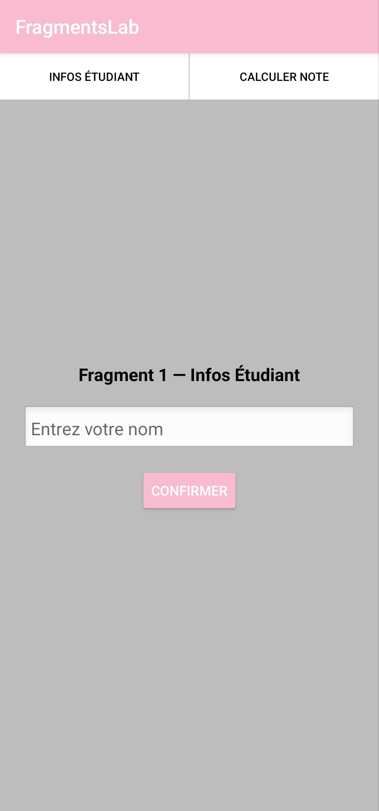
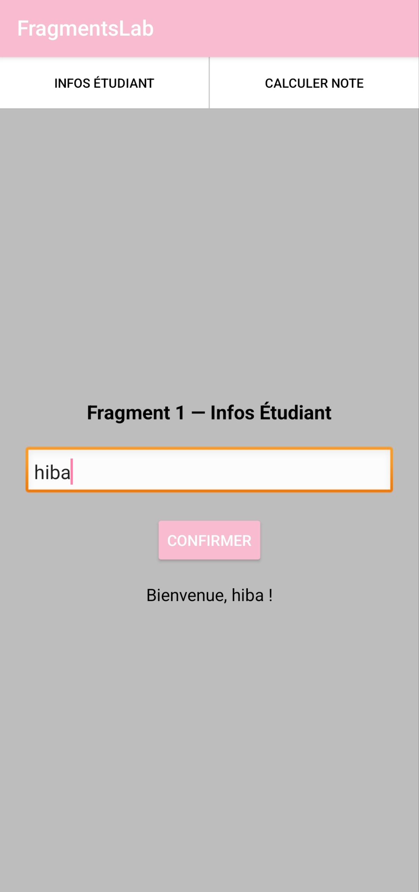
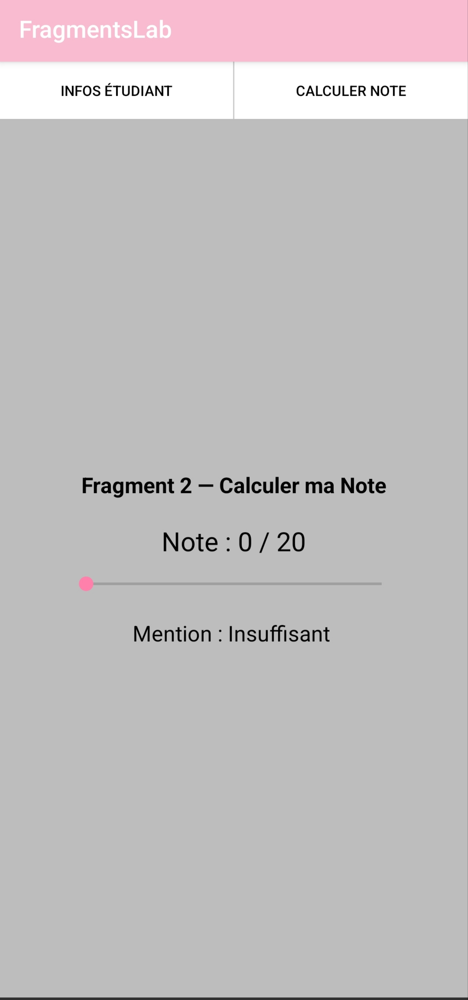
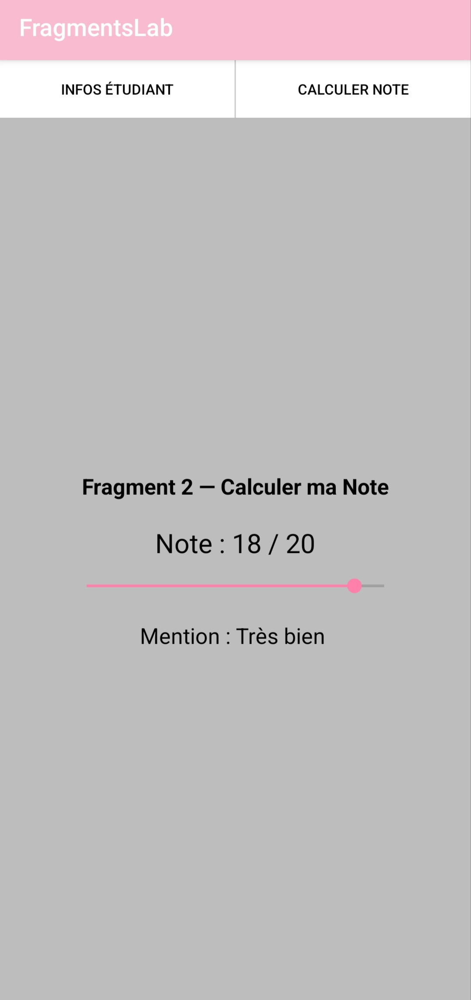

# FragmentsLab

## Description
This project is a simple Android application developed using Java and XML. It allows the user to navigate between two fragments: one for entering student information, and one for calculating a grade mention using a slider.

## Features
- Input of student name
- Button to confirm and display a welcome message
- SeekBar to select a grade from 0 to 20
- Automatic display of the corresponding mention (Très bien, Bien, Assez bien, Passable, Insuffisant)
- Navigation between fragments via two buttons
- State preserved on screen rotation

## Technologies
- Java
- XML
- Android Studio

## Project Structure

```
FragmentsLab/
└── app/
    └── src/
        └── main/
            ├── java/com/example/noteslab/
            │   ├── MainActivity.java
            │   ├── StudentInfoFragment.java
            │   └── GradeFragment.java
            └── res/layout/
                ├── activity_main.xml
                ├── fragment_student_info.xml
                └── fragment_grade.xml
```

## How it works
The application contains one activity and two fragments.
- The user navigates between fragments using the two buttons at the top
- **Fragment 1:** the user enters their name and clicks "Confirmer" to display a welcome message
- **Fragment 2:** the user moves the SeekBar to select a grade; the mention is calculated using the following logic:

```
≥ 16  → Très bien
≥ 14  → Bien
≥ 12  → Assez bien
≥ 10  → Passable
< 10  → Insuffisant
```

- The back button returns to the previous fragment
- State (name message, SeekBar value) is restored after screen rotation

## How to run
1. Open the project in Android Studio
2. Build the project
3. Run it on an emulator or a physical Android device

## Screenshots

Start:

Fragment 1:

Fragment 2:



## Notes
This project is intended for practicing Android fragment management concepts such as dynamic fragment transactions, FragmentManager navigation, state saving with `onSaveInstanceState()`, and fragment lifecycle observation.
